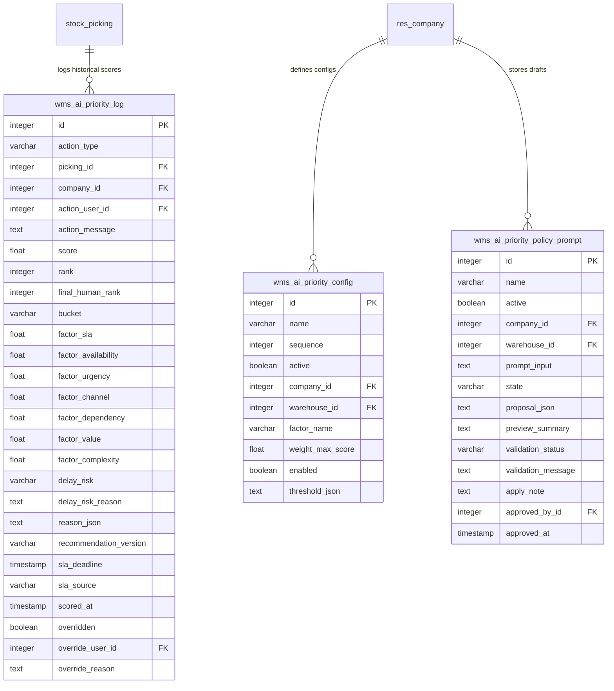

# Odoo Picking Priority Database & Table Structure

This document provides a detailed overview of how Odoo 19 maps Python models to PostgreSQL database tables, how Odoo inheritance works, and details the specific database schema modifications and additions introduced by the **Picking Priority Agent** (`odoo_picking_priority`) custom addon.

---

## 1. How Odoo ORM & Inheritance Work

Odoo uses an Object-Relational Mapping (ORM) framework to map Python classes directly to PostgreSQL database tables. 

### Model-to-Table Mapping Naming Convention
By default, Odoo replaces dots (`.`) in the model's `_name` attribute with underscores (`_`) to determine the database table name.
*   **Model:** `stock.picking` $\rightarrow$ **PostgreSQL Table:** `stock_picking`
*   **Model:** `wms.ai.priority.config` $\rightarrow$ **PostgreSQL Table:** `wms_ai_priority_config`

### Types of Odoo Models
Odoo supports three primary model types, each behaving differently in the database:
1.  **Standard Persistent Models (`models.Model`)**:
    *   Creates permanent tables in PostgreSQL.
    *   Data is stored persistently until explicitly deleted.
2.  **Transient Models (`models.TransientModel`)**:
    *   Used for interactive wizards, popups, and temporary configurations.
    *   Creates tables in PostgreSQL, but Odoo runs a system cron job (vacuum cleaner) to periodically delete records older than a few hours.
3.  **Abstract Models (`models.AbstractModel`)**:
    *   Acts as a reusable template/mixin (no database table is created).
    *   Other models inherit its fields and methods.

### How Model Inheritance Works in Odoo
Odoo provides three types of inheritance to extend existing models:

#### A. Class Inheritance (`_inherit` only) — *Used extensively in this addon*
```python
class StockPicking(models.Model):
    _inherit = "stock.picking"
    x_ai_priority_score = fields.Float("Priority Score (%)")
```
*   **Behavior:** Modifies the parent model in-place.
*   **Database Impact:** Odoo **does not** create a new table. Instead, it adds the new fields as columns directly to the **original** parent table (e.g., adding `x_ai_priority_score` to the existing `stock_picking` table).

#### B. Prototype Inheritance (`_inherit` + `_name`)
```python
class CustomPicking(models.Model):
    _name = "custom.picking"
    _inherit = "stock.picking"
```
*   **Behavior:** Creates a brand-new model while copying all fields, methods, and configurations from the parent.
*   **Database Impact:** Odoo creates a new table `custom_picking` containing all inherited columns plus any new ones defined. The original `stock_picking` table remains untouched.

#### C. Delegation Inheritance (`_inherits`)
```python
class PickingDetail(models.Model):
    _name = "picking.detail"
    _inherits = {'stock.picking': 'picking_id'}
    picking_id = fields.Many2one('stock.picking', required=True, ondelete='cascade')
```
*   **Behavior:** Polymorphic composition. The child model holds a foreign key to the parent model. When a field on the parent is accessed from the child, Odoo transparently retrieves it.
*   **Database Impact:** Creates a separate table linked by a 1-to-1 relationship to the parent table.

---

## 2. Original Odoo 19 Tables Extended

The `odoo_picking_priority` addon uses **Class Inheritance (`_inherit`)** to add custom business logic and fields to original Odoo tables. No new tables are created for these models; their original tables are altered.

### A. Table: `res_partner` (Model: `res.partner`)
Stores customer and vendor master data.
*   **Custom Field Added:**
    *   `x_customer_sla_days` (Type: `Float`): Stores customer-specific Service Level Agreement (SLA) in days (e.g., `2.0` days for shipping cutoff).

### B. Table: `res_company` (Model: `res.company`)
Stores multi-company records and settings.
*   **Custom Fields Added:**
    *   `x_ai_include_waiting_pickings` (Type: `Boolean`): Determines if pickings in the `waiting` state (waiting on other operations) are scored.
    *   `x_ai_use_external_scoring` (Type: `Boolean`): Flag to send picking data to an external API instead of calculating scores locally.
    *   `x_ai_scoring_endpoint` (Type: `Char`): HTTP URL of the external scoring API.
    *   `x_ai_scoring_token` (Type: `Char`): Bearer authorization token for the API.
    *   `x_ai_scoring_timeout` (Type: `Integer`): API connection timeout limit in seconds.

### C. Table: `stock_picking` (Model: `stock.picking`)
Stores warehouse transfers (Receipts, Delivery Orders, and Internal Transfers).
*   **Custom Fields Added (Scoring & Ranks):**
    *   `x_ai_priority_score` (Type: `Float`): Computed overall priority percentage (0.0 to 100.0).
    *   `x_ai_priority_bucket` (Type: `Selection`): Categorizes picking into `critical`, `high`, `medium`, or `low`.
    *   `x_ai_priority_rank` (Type: `Integer`): Automated sequence ranking based solely on priority score.
    *   `x_manual_priority_rank` (Type: `Integer`): The manual priority rank value assigned by a supervisor.
    *   `x_manual_priority_rank_display` (Type: `Integer`): Active supervisor-forced rank (only set if manual override is active).
    *   `x_display_priority_rank` (Type: `Integer`): Final operational picking rank (forces overridden pickings to the top).
*   **Custom Fields Added (Explanations & Risks):**
    *   `x_ai_priority_reason` (Type: `Text`): Human-readable breakdown of factors contributing to the score.
    *   `x_ai_priority_reason_json` (Type: `Text`): Structured JSON backup of all computed factors.
    *   `x_ai_delay_risk` (Type: `Selection`): Calculated risk of missing SLA (`critical`, `high`, `medium`, `low`).
    *   `x_ai_delay_risk_reason` (Type: `Text`): Text explaining the delay risk factors.
    *   `x_ai_recommended_action` (Type: `Selection`): Next action (e.g., `pick_now`, `pick_next`, `expedite_stock`, `pick_available_and_replenish`).
    *   `x_ai_last_scored_at` (Type: `Datetime`): Timestamp of the last score calculation.
    *   `x_ai_recommendation_version` (Type: `Char`): Version tracker for scoring algorithms.
*   **Custom Fields Added (Manual Override Controls):**
    *   `x_ai_manual_override` (Type: `Boolean`): Indicates if a supervisor has manually locked/overridden the rank.
    *   `x_ai_override_reason` (Type: `Text`): Reason written by the supervisor for the override.
    *   `x_ai_override_user_id` (Type: `Many2one` $\rightarrow$ `res.users`): Reference to the user who performed the override.
    *   `x_ai_override_datetime` (Type: `Datetime`): Timestamp of the manual override action.
*   **Custom Fields Added (SLA & Channel):**
    *   `x_ai_sla_deadline` (Type: `Datetime`): The resolving operational deadline for the transfer.
    *   `x_ai_sla_manual` (Type: `Boolean`): Flag indicating if the SLA deadline was manually entered rather than auto-computed.
    *   `x_ai_dispatch_cutoff` (Type: `Datetime`): Supervisor dispatch cut-off window.
    *   `x_ai_customer_sla_date` (Type: `Date`): SLA computed from customer profile days.
    *   `x_effective_priority_deadline` (Type: `Datetime`): The active deadline used by priority scoring.
    *   `x_ai_urgency_level` (Type: `Selection`): Urgency state (`normal`, `high`, `critical`).
    *   `x_ai_urgency_manual` (Type: `Boolean`): Flag indicating if the urgency level was manually locked.
    *   `x_ai_source_channel` (Type: `Selection`): Sales/order origination channel (e.g., `marketplace`, `retail_store`, `b2b`, `internal_transfer`, `store_replenishment`).
*   **Custom Fields Added (Scoring Factor Debug & Stocks):**
    *   `x_ai_factor_sla` / `x_ai_factor_availability` / `x_ai_factor_urgency` / `x_ai_factor_channel` / `x_ai_factor_dependency` / `x_ai_factor_value` / `x_ai_factor_complexity` (Type: `Float`): Separate raw score components for each priority factor.
    *   `x_ai_total_demand_qty` (Type: `Float`): Total quantities requested on all picking lines.
    *   `x_ai_total_reserved_qty` (Type: `Float`): Total quantities currently reserved/allocated.
    *   `x_ai_availability_ratio` (Type: `Float`): Percentage of stock reserved (0.0 to 100.0%).
    *   `x_ai_stock_gap_summary` (Type: `Text`): Text summarizing missing products and stock gaps.
    *   `x_ai_complexity_product_count` (Type: `Integer`): Count of unique products in the transfer.
    *   `x_ai_complexity_zone_count` (Type: `Integer`): Count of warehouse zones touched by source locations.

---

## 3. Custom Database Tables Added

The addon creates several **new database tables** in PostgreSQL to manage priority configuration, audit logging, and natural language policy drafting.



### A. Table: `wms_ai_priority_config`
Stores the configuration weights for the 7 picking priority scoring dimensions. Weights can be configured globally, per company, or per warehouse.
*   **`id`** (Serial, Primary Key): Unique row identifier.
*   **`name`** (Varchar, Required): Name of the scoring factor.
*   **`sequence`** (Integer, Default: 10): Ordering position.
*   **`active`** (Boolean, Default: True): Toggle config active status.
*   **`company_id`** (Integer $\rightarrow$ `res_company`, Index): FK to Company.
*   **`warehouse_id`** (Integer $\rightarrow$ `stock_warehouse`, Index): FK to Warehouse (allows warehouse-specific rules).
*   **`factor_name`** (Varchar, Required): Selection key (`sla`, `availability`, `urgency`, `channel`, `dependency`, `value`, `complexity`).
*   **`weight_max_score`** (Float, Required): Max priority points allocated to this factor (sum of all factors must equal 100.0).
*   **`enabled`** (Boolean, Default: True): Switch to toggle scoring for this factor.
*   **`threshold_json`** (Text): Advanced JSON thresholds for incremental scoring metrics.
*   *SQL Constraint:* Unique compound index on `(company_id, warehouse_id, factor_name)`.

### B. Table: `wms_ai_priority_log`
An immutable ledger tracking picking recalculations, supervisor overrides, settings modifications, and AI prompts.
*   **`id`** (Serial, Primary Key): Unique row identifier.
*   **`action_type`** (Varchar, Required): Type of event (e.g., `manual_override`, `picking_recalculated_auto`, `config_updated`, `ai_question`).
*   **`picking_id`** (Integer $\rightarrow$ `stock_picking`, Index, On Delete: Set Null): Reference to the modified transfer.
*   **`company_id`** (Integer $\rightarrow$ `res_company`, Index, Required): Company context of the log.
*   **`action_user_id`** (Integer $\rightarrow$ `res_users`, Required): Reference to the user who triggered the event.
*   **`action_message`** (Text): Detail description of what occurred.
*   **`score`** (Float) / **`rank`** (Integer) / **`final_human_rank`** (Integer): Snapshot values of the picking when logged.
*   **`bucket`** (Varchar): Priority bucket categorization.
*   **`factor_sla`** through **`factor_complexity`** (Float): Individual factor scores at the log moment.
*   **`delay_risk`** (Varchar) / **`delay_risk_reason`** (Text): Snapshot of delay metrics.
*   **`reason_json`** (Text): The raw mathematical breakdown backup.
*   **`recommendation_version`** (Varchar): Algorithmic engine version.
*   **`sla_deadline`** (Timestamp) / **`sla_source`** (Varchar): SLA deadline details.
*   **`scored_at`** (Timestamp, Default: Now): Time record was logged.
*   **`overridden`** (Boolean) / **`override_user_id`** / **`override_reason`**: Snapshot of supervisor override conditions.

### C. Table: `wms_ai_priority_policy_prompt`
Stores natural language instruction prompts used to draft priority policy weights (e.g., "Give e-commerce marketplace orders higher priority near month-end").
*   **`id`** (Serial, Primary Key): Unique row identifier.
*   **`name`** (Varchar, Required): Name describing the policy draft.
*   **`active`** (Boolean, Default: True): Archive toggle.
*   **`company_id`** (Integer $\rightarrow$ `res_company`, Required): Target company.
*   **`warehouse_id`** (Integer $\rightarrow$ `stock_warehouse`): Target warehouse.
*   **`prompt_input`** (Text, Required): Natural language policy prompt.
*   **`state`** (Varchar, Required): Wizard step status (`draft`, `ready`, `applied`, `error`).
*   **`proposal_json`** (Text): AI-generated weight proposal structured as JSON.
*   **`preview_summary`** (Text): Human-readable explanation of proposed changes.
*   **`validation_status`** (Varchar): Status of JSON verification (`pending`, `valid`, `invalid`).
*   **`validation_message`** (Text): Detail warnings if validation fails.
*   **`apply_note`** (Text): Caution notes before making real settings adjustments.
*   **`approved_by_id`** (Integer $\rightarrow$ `res_users`): Supervisor who approved and applied the draft.
*   **`approved_at`** (Timestamp): Date and time the rules went live.

---

## 4. Transient Models (Temporary Wizard Tables)

Odoo creates database tables for transient wizards to hold state during form submission. These tables do not store permanent records.

| Transient Model Name | PostgreSQL Table Name | Description / Purpose |
| :--- | :--- | :--- |
| `wms.ai.priority.popup` | `wms_ai_priority_popup` | Holds related fields from a picking to display priority details inside a popup modal. |
| `wms.ai.picking.assistant` | `wms_ai_picking_assistant` | Maintains state for the "Ask AI" interactive picking chatbot. |
| `wms.ai.priority.queue.summary` | `wms_ai_priority_queue_summary` | Manages filters and holds text for generated warehouse queue risk summaries. |
| `wms.ai.priority.ai.config.wizard`| `wms_ai_priority_ai_config_wizard`| Temporary form to collect, encrypt, and test AI endpoint credentials. |
| `wms.ai.priority.whatif` | `wms_ai_priority_whatif` | Holds natural language input and simulated outcome statistics for "What-If" policy simulations. |
| `wms.ai.priority.search` | `wms_ai_priority_search` | Interprets supervisor natural language search phrases into structured Odoo domains. |

---

## 5. Non-Database Mixins

*   **Model Name:** `wms.ai.copilot.mixin`
*   **Database Impact:** **None** (Inherits `models.AbstractModel`).
*   **Purpose:** Houses shareable communication logic (such as calls to OpenRouter, OpenAI, and Gemini API endpoints) and JSON parsing utilities. It is inherited dynamically by the policy wizards, picking assistant, what-if simulator, and search models.
